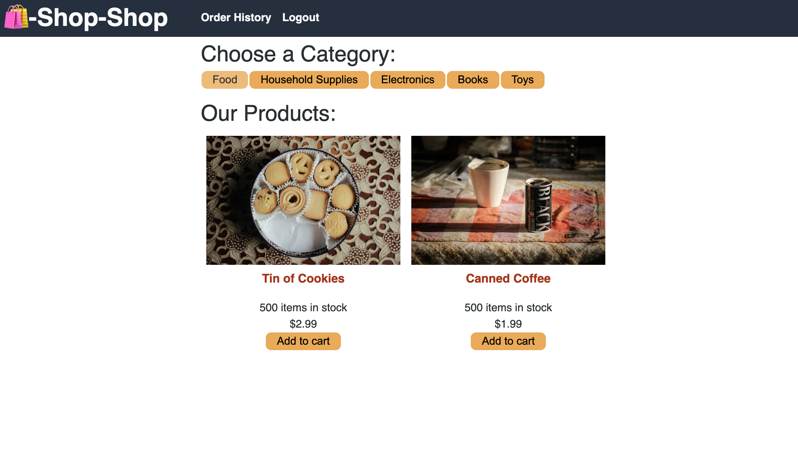
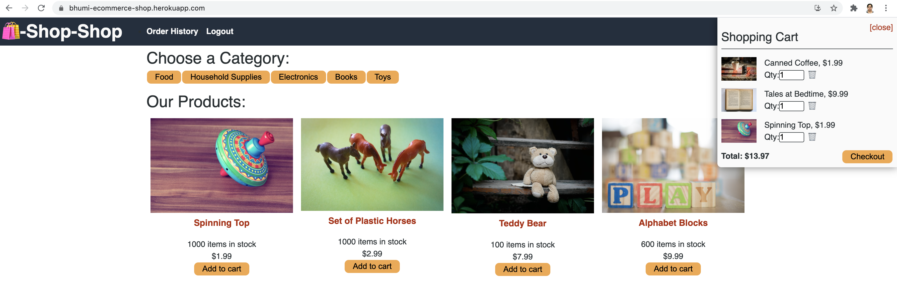
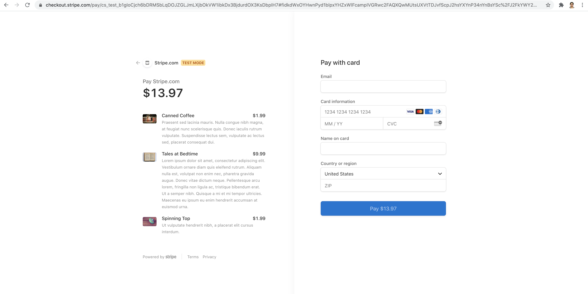
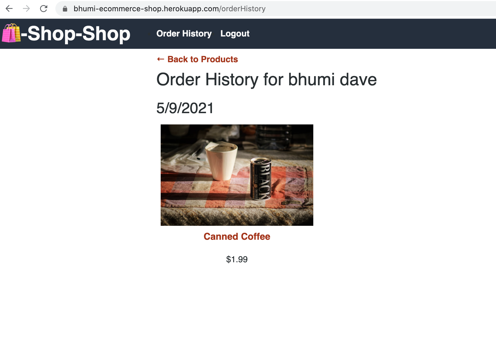

# E-Commerce

    E-Commerce is React Redux application where user can signUp/login then you can purchase products based on categories. 
    Stipe is used to make payment. Whole application is written in React / GraphQL with Redux.
    It is PWA application. Mainly PWA application allows user to perform operation even if they are not connected to internet (offline).
    

### Technology 
    - Mongoose api which help to connect Mongo DB
    - Mongo Db ( you can install mongo thru homebrew)
    - Node.JS
    - Express
    - MongoDB Atlas
    - GraphQL
    - Redux ( Context APi code changed to redux provider/action and reducer)
    - Bcrypt

    You also need to add Service Worker for caching.
    This application is deployed on Heroku so MongoDB Atlas is used for MongoDB.

### Installation

To install dependencies, run the following command: 

```npm install```

This will install mongoose, express libraries which are used in project.

### Project Deployment / GitHub Details

To clone the project:
- SSH - git@github.com:bhumisha/shop-shop.git
- HTTPS - https://github.com/bhumisha/shop-shop.git
 
Project Source code : https://github.com/bhumisha/shop-shop

This application is deployed on Heroku. PFB Heroku link
https://bhumi-ecommerce-shop.herokuapp.com/

### Images

Home / Product page



Shopping Cart 



Payment Page



Success Page


Order History Page




### Questions
If you have any additional questions about the repo, open an issue or contact me directly at bhumishadave@gmail.com.  
You can fine more of my work at bhumisha
